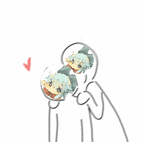
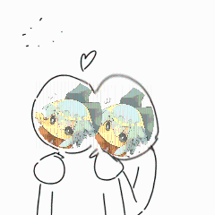
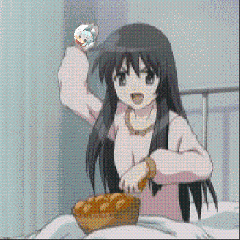
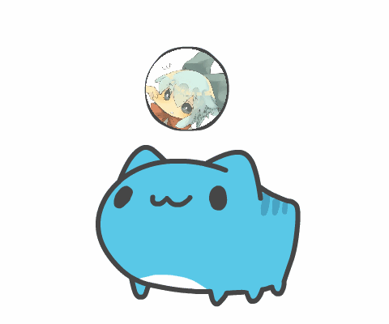
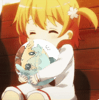
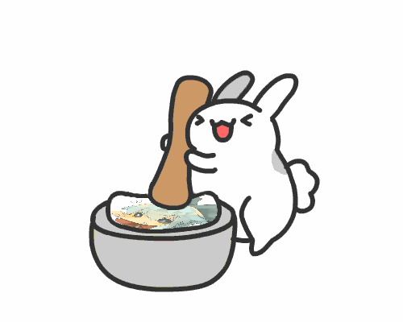
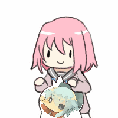
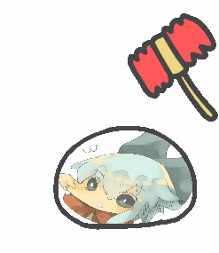
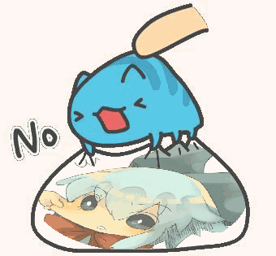

# Petpet


[](https://jitpack.io/#Dituon/petpet)

一个生成摸摸头GIF的 Mirai 插件，灵感/部分数据来自 [nonebot-plugin-petpet](https://github.com/noneplugin/nonebot-plugin-petpet)。

java 编写，**未使用任何第三方库** ：轻量，高效。

**[在线编辑器](https://dituon.github.io/petpet/editor)**

## 使用方法

1. 下载 [最新版本](https://github.com/Dituon/petpet/releases/)

2. 将插件放入 `Mirai/plugins/`

3. 下载 [图片素材](https://github.com/Dituon/petpet/tree/main/data/xmmt.dituon.petpet)

4. 将图片素材放入 `Mirai/data/xmmt.dituon.petpet`

5. 使用 **戳一戳** 有 `30%` 的概率触发; 或发送 `pet @xxx`

> `pet key @xxx` 或 `key @xxx` 可返回指定图片 例如 `pet kiss @xxx` `kiss @xxx`

> 可通过发送的图片生成Petpet `kiss [图片]`, **支持GIF**
>> 可通过回复构造图片, 例如 `[图片]` -> `[回复[图片]] 对称` (暂不支持 回复机器人发送的消息)

> 可使用 `pet`指令 获取 `keyList`

**以上配置 均可在配置文件中修改**

## 配置文件

首次运行 Petpet 插件时，会生成 `Mirai/config/xmmt.dituon.petpet/Petpet.yml` 文件

```
content: 
  command: pet #触发 petpet 的指令
  probability: 30 #使用 戳一戳 的触发概率
  antialias: true #抗锯齿
  disabled: [] #禁用列表

  keyCommandHead: '' #keyCommand前缀
  respondReply: true #响应回复
  cachePoolSize: 10000 #消息缓存池容量

  respondSelfNudge: false #响应机器人发出的戳一戳
  keyListFormat: FORWARD #keyList响应格式
  fuzzy: false #模糊匹配用户名

  synchronized: false #消息事件同步锁
  headless: true #使用headless模式
  autoUpdate: true #自动从仓库同步PetData
  updateIgnore: [] #更新忽略表列
  repositoryUrl: 'https://dituon.github.io/petpet' #仓库地址, 用于自动更新
```

#### 配置项说明

<details>

<summary>展开/收起</summary>
<br/>

- **command**: `pet`

> 触发petpet指令, 默认为`pet`
> 
> 例: `pet @xxx` `pet kiss @xxx`
> 
> 仅发送`pet`时会返回`keyList`
<br/>

- **probability**: `30`

> 戳一戳 触发概率, `0-100`整数, 默认为 `30%`
<br/>

- **antialias**: `true`

> 画布抗锯齿, 默认为`true`
<br/>

- **disabled**: `[]`

> 禁用表列, 默认为空, 在此数组中的`key`不会被随机触发 (会覆盖`data.json`中的配置)
<br/>

- **keyCommandHead**: `''`

> `key`作为指令头时的前缀, 默认为空
> 
> 例 (配置项为`'#'`时): `#kiss @xxx` `osu hso!`
<br/>

- **respondReply**: `true`

> 响应回复的消息, 默认为`true`
> 
> 可通过回复消息 定位到之前发送的图片并构造petpet
> 
> 启用后 会缓存接收到的图片(见`cachePoolSize`)
> 
> 例 : `[回复[图片]]kiss`(等价于 `kiss [图片]`)
<br/>

- **cachePoolSize**: `10000`

> `respondReply=true`时, 图片消息缓存池大小, 默认为`10000`
> 
> 本质为`HashMap<imageId(long), imageUrl(String)>`, 超过此限制会清空Map
<br/>

- **respondSelfNudge**: `false`

> 某些情况下, 机器人会主动戳其他成员, 响应机器人自己发出的戳一戳, 默认为`false`
<br/>

- **keyListFormat**: `FORWARD`

> 发送`pet`时 `keyList`响应格式, 默认为`FORWARD`
>
> 枚举: `MESSAGE`(发送普通消息)  `FORWARD`(发送转发消息)  `IMAGE`(发送图片)
<br/>

- **fuzzy**: `false`

> 模糊匹配用户名, 默认为`false`
> 
> 例 (配置项为`true`时): `kiss @田所浩二`(响应) `kiss 浩二`(响应)
<br/>

[//]: # (- **strictCommand**: `true`)

[//]: # ()
[//]: # (> 严格匹配指令, 默认为`true`)

[//]: # (> )

[//]: # (> ~~人话: 可以省略key后的空格~~)

[//]: # (> )

[//]: # (> 例 &#40;配置项为`false`时&#41;: `kiss 田所`&#40;响应&#41; `kiss田所`&#40;响应&#41;)

[//]: # (<br/>)

- **synchronized**: `false`

> 消息事件同步锁, 会锁住相同的消息事件, 默认为`false`
> 
> ~~人话: 多机器人对于同一条指令只有一个会响应~~
<br/>

- **headless**: `true`

> 启用`hradless`模式, 默认为`true`
> 
> ~~人话: 有些服务器没有输入输出设备, 画图库无法正常运行, 启用这个配置项可以修复, 因为总是有人不看常见问题, 干脆默认启用了(~~
<br/>

- **autoUpdate**: `true`

> 自动更新`PetData`, 每次启动时都会检查并自动下载船新pet, 默认为`true`
> 
> 注: 仅更新`PetData`, 不会更新插件版本, 请放心食用
> 
> ~~人话: 每次启动都会自动下载新的超赞梗图, 墙裂推荐~~
<br/>

- **updateIgnore**: `[]`

> 忽略表列, 默认为空, 在此数组中的`key`不会被自动更新
<br/>

- **repositoryUrl**: `'https://dituon.github.io/petpet'`

> 仓库地址, 用于自动更新, 默认为此仓库的`github page`

</details>

修改后重启 Mirai 以重新加载

## 权限管理

> 群主或管理员使用 `pet on` `pet off` 以 启用/禁用 戳一戳

> 可在配置文件中禁用指定key, 被禁用的key不会随机触发, 但仍可以通过指令使用

## 图片预览

**图片按key排序(见`data/xmmt.dituon.petpet/`)**

<details>
<summary>展开/收起</summary>

| key     | 预览                   |
|---------|----------------------|
| kiss    |   |
| rub     |   |
| throw   |   |
| petpet  |   |
| play    |   |
| roll    |   |
| bite    |   |
| twist   |   |
| pound   |   |
| thump   |   |
| knock   |  |
| suck    |  |
| hammer  |  |
| tightly |  |

**..more&more**

</details>

## 自定义

**[在线编辑器](https://dituon.github.io/petpet/editor)**

### data.json

`./data/xmmt.dituon.petpet/` 下的目录名为 `key` ，插件启动时会遍历 `./data/xmmt.dituon.petpet/$key/data.json`

`data.json` 标准如下 (以 `thump/data.json` 为例)

```
{
  "type": "GIF", // 图片类型(enum)
  "avatar": [{ //头像(objArr), 参考下文
      "type": "TO",
      "pos": [
        [65, 128, 77, 72], [67, 128, 73, 72], [54, 139, 94, 61], [57, 135, 86, 65]
      ],
      "round": true,
      "avatarOnTop": false
    }],
  "text": [] //文字(objArr), 参考下文
}
```

##### 图片类型枚举

**`type`**

- `GIF`  动图
- `IMG`  静态图片

#### 坐标

坐标的基本组成单位是 4长度 `int[]` 数组

其中，前两项为 **左上角顶点坐标**， 后两项为 **宽度和高度**

例:
`[65, 128, 77, 72]` 即 头像的左上角顶点坐标是 `(65,128)`, 宽度为 `77`, 高度为 `72`

如果是 `GIF` 类型，坐标应为二维数组，`GIF` 的每一帧视为单个图像文件

```
"pos": [ // pos的元素对应GIF的4帧
    [65, 128, 77, 72], [67, 128, 73, 72], [54, 139, 94, 61], [57, 135, 86, 65]
  ],
```

如果是`IMG`类型, 可以使用一维数组

```
  "pos": [0, 0, 200, 200]
```

> `4.0`版本后, 坐标支持变量运算, 例如 `[100,100,"width/2","height*1.5^2"]`

###### 仿射变换/图像变形

**坐标格式枚举`posType`**

- `ZOOM`  缩放(见上文)
- `DEFORM`  变形

`DEFORM` 坐标格式为 `[[x1,y1],[x2,y2],[x3,y3],[x4,y4],[x_anchor,y_anchor]]`;
分别对应图片的`[[左上角],[左下角],[右下角],[右上角],[锚点]]`，四角坐标用相对于锚点的偏移量表示

目前仿射变换仅支持单帧

#### 头像

`3.0`版本后 提供了更灵活的头像构造方法, 与之前的版本有很大差别

```
"avatar": [
    {
      "type": "FROM", //头像类型枚举(enum), 非空
      "pos": [[92, 64, 40, 40], [135, 40, 40, 40], [84, 105, 40, 40]], // 坐标
      "round": true, // 值为true时, 头像裁切为圆形, 默认为false
      "avatarOnTop": true // 值为true时, 头像图层在背景之上, 默认为true
      "angle": 90, // 初始角度
    },
    {
      "type": "TO", 
      "pos": [[5, 8], [60, 90], [50, 90], [50, 0], [60, 120]],
      "posType": "DEFORM", // 图像变形 坐标格式, 默认为ZOOM
      "antialias": true, // 抗锯齿, 对头像单独使用抗锯齿算法, 默认为false
      "rotate": false // 值为true时, GIF类型的头像会旋转, 默认为false
    },
    {
      "type": "GROUP", 
      "pos": [[182, 64, "width/2", "height*1.5^2"], [225, 40, "40", 40], [174, 105, 40, "height+width"]], // 支持变量运算
      "crop": [0, 0, 50, 100], // 图片裁切坐标[x1, y1, x2, y2], 可简写为 [50, 100]
      "cropType": "PERCENT", // 裁切格式, 默认为NONE
      "style": [ // 风格化
        "MIRROR",
        "GRAY"
      ]
    }
  ]
```

> 在`IMG`中, 当`rotate = true`时, 头像会随机旋转角度, `angle`为最大值(`angle = 0`时, 随机范围为`0-359`)

**头像类型枚举 `type`**

- `FROM`  发送者头像
- `TO`  接收者头像, 或构造的图片
- `GROUP`  群头像
- `BOT`  机器人头像

**裁切格式枚举 `cropType`**

- `NONE`  不裁切
- `PIXEL`  按像素裁切
- `PERCENT`  按百分比裁切

**风格化枚举 `style`**

- `MIRROR`  水平镜像
- `FLIP`  上下翻转
- `GRAY`  灰度化
- `BINARIZATION`  二值化

**坐标变量**

- `width`  原图宽度
- `height`  原图高度

#### 文字

如果你想在图片上添加文字，可以编辑 `text`

```
"text": [ // 这是一个数组, 可以添加很多文字
    {
      "text": "Petpet!", // 文字内容
      "color": "#66ccff", // 颜色, 默认为#191919
      "pos": [100, 100], // 坐标, 默认为 [2,14]
      "size": 24 // 字号, 默认为12
    },
    {
      "text": "发送者: $from, 接收者: $to", // 支持变量
      "color": [0,0,0,255], // 颜色可以使用RGB或RGBA的格式
      "pos": [20, 150], // 坐标
      "font": "宋体" // 字体, 默认为黑体
    },
    {
      "text": "$txt1[我]超市$txt2[你]!", // 支持关键词变量
      "pos": [0,200,300], // 第三个值为文本最大宽度
      "align": "CENTER", // 对齐方式, 默认为LEFT
      "wrap": "ZOOM" // 显示设置, 默认为NONE
    }
  ]
```

**`变量`**

- `$from` : 发送者, 会被替换为发送者群名片，如果没有群名片就替换为昵称
- `$to` : 接收者, 被戳或At的对象, 发送图片构造时为"你"
- `$group` : 群名称
- `$txt(i)[(xxx)]` : 文本变量, 可用于生成meme图, i为关键词索引, xxx为默认值; 例: `$txt1[我]超市$txt2[你]` 指令为 `pet [key] 我 你`

**`font`**

在`data/fonts`目录下的字体文件会注册到环境中

**`align`**

- `LEFT`: 左对齐
- `RIGHT`: 右对齐
- `CENTER`: 居中对齐

**`wrap`**

- `NONE`: 不换行
- `BREAK`: 自动换行
- `ZOOM`: 自动缩放
>> 使用`BREAK`或`ZOOM`时, `maxWidth` 默认为`200`

**需要更多变量请提交 Issue**

#### `background`

`4.0`版本后, 支持动态创建画布

```
"background": {
    "size": ["avatar0Width*2","avatar0Height"] //支持变量运算
  }
```

**坐标变量**

- `avatar(i)Width`  `i`号头像(`i`为定义头像时的顺序, 从`0`开始)处理后的宽度
- `avatar(i)Height`  `i`号头像处理后的高度
- `text(i)Width`  `i`号文本渲染后的宽度
- `text(i)Height`  `i`号文本渲染后的高度

## `WebServer`
  
除了作为`Mirai`插件, `Petpet` 也可以作为**http服务器**单独运行, 可被其它项目/语言使用

`java -jar petpet.jar`

启动时会生成 `config.json`:
```
{
  "port": 2333, //监听端口
  "threadPoolSize": 10, //线程池容量
  "headless": true //使用headless模式
}
```

#### `PetServer API`

访问 `127.0.0.1:2333/petpet` 以获取 `PetDataList`

使用 `GET` 传递参数, 例如 `127.0.0.1:2333/petpet?key=petpet&toAvatar=$avatarUrl`
`127.0.0.1:2333/petpet?key=osu&textList=hso!`

**结构**
<details>
<summary>展开/收起</summary>

- `key`(str): 对应`PetData`,例如`kiss` `rub`
- `fromAvatar` `toAvatar` `groupAvatar` `botAvatar`(url): 头像URL地址
- `fromName` `toName` `groupName`(str): 昵称, 有默认值
- `textList`(str): 根据空格分割此字符串, 作为额外数据
</details>

> 更多示例请参考`example-script`

## 常见问题

- 戳一戳无法触发?
  > 检查 Mirai 登录协议, 仅 `ANDORID_PHONE` 可以收到 戳一戳 消息

- 没有生成配置文件?
  > `Mirai 2.11.0` 提供了新的 `JavaAutoSaveConfig` 方法, 请更新Mirai版本至 `2.11.0` (不是`2.11.0-M1`), 旧版本不支持自定义配置项

- `Exception in coroutine <unnamed>`?
  > 图片素材应位于 `Mirai/data/xmmt.dituon.petpet` 目录下, 请检查路径

- `Could not initialize class java.awt.Toolkit`?
  > 对于无输入输出设备的服务器 需要启用`headless`

- 自动更新下载速度慢?
  > 修改`Petpet.yml`中`repositoryUrl`的值为`'https://ghproxy.com/https://raw.githubusercontent.com/Dituon/petpet/main'`(高速镜像)

- 自动更新后 读取`data.json`出错?
  > 自动更新时网络出错导致, 删除出错的文件 重新获取即可

## 分享你的作品

如果你想分享自定义的 Petpet, **欢迎Pr**

## 依赖share包二次开发

- 方式1. 在本项目内二次开发（非mirai插件形式）：见`xmmt.dituon.example.SimpleUsage`
- 方式2. 在别的项目二次开发：[mirai-simplepetpet-plugin](https://github.com/hundun000/mirai-simplepetpet-plugin)

## 后话

如果此插件和您预期的一样正常工作，请给我一个 `star`

欢迎提交任何请求

交流群: `534814022`
