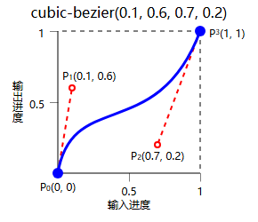

# Image Element

基础配置如下

```jsonc
{
    "type": "image",
    "key": "to",    // 与输入数据匹配的键名
    "default": "https://picsum.photos/200", // 默认值
    "coords": [0, 0, 200, 200], // 图像坐标
    "border_radius": "4px"      // 圆角
}
```

| **属性**            | **类型**                                 | **描述**            | **默认值**     |
|-------------------|----------------------------------------|-------------------|-------------|
| **key**           | string                                 | 与输入数据匹配的键名        | `"unknown"` |
| **default**       | [ImageSrc](#imagesrc)                  | 默认图像地址, 别名为 `src` | 无           |
| **coords**        | [Coords](#coords)                      | 图像坐标              | 必须          |
| **crop**          | [Crop](#crop)                          | 图像裁剪坐标            | 无           |
| **fit**           | [Fit](#fit)                            | 图像适应方式            | `fill`      |
| **position**      | [Offset](./length.md#offset)           | 图像适应偏移            | `center`    |
| **rotate**        | [RotateTransition](#rotate-transition) | 图像旋转函数            | `false`     |
| **angle**         | float                                  | 顺时针方向旋转角度，单位为度    | `0`         |
| **origin**        | [Offset](./length.md#offset)           | 图像旋转原点            | `center`    |
| **opacity**       | float                                  | 图像不透明度，取值范围[0, 1] | `1`         |
| **border_radius** | [BorderRadius](#borderradius)          | 边框圆角半径            | `0`         |
| **filter**        | [Filter](./filter.md#image-filter)[]   | 图像滤镜              | 无           |

## 动画

参数可使用数组实现动画, 例如:

```jsonc
{
  "type": "gif",
  "canvas": {
    "width": 300,
    "height": 300,
    "length": 5         // 动画帧数
  },
  "elements": [{
    "type": "image",
    "key": ["to"],
    "coords": [[0, 0, 100, 100], [50, 50, 150, 150]],
    "angle": [0, 45, 90, 135, 180],
    "opacity": [0, 0.2, 0.4, 0.6, 0.8],
    "border_radius": ["0", "20px 30px", "50%"]
  }]
}
```

> `filter` 动画实现方式与其它属性不同, 参见 [filter](./filter.md#动画)。

## ImageSrc

表示图像资源地址, 可以为网络地址或本地地址。

示例:

- `https://picsum.photos/200`: 网络图像地址
- `file://./avatar.gif`: 本地图像地址, 指向GIF图像
- `../default.png`: 本地图像地址, 使用相对路径
- `./gif-bgs`: 本地图像地址, 指向图像序列目录

```text
templates/
├─ my-template/
│  ├─ avatar.gif
│  ├─ gif-bgs/
│  │  ├─ 0.png
│  │  ├─ 1.png
│  │  ├─ 2.png
│  │  ├─ 3.png
│  ├─ template.json
├─ default.png
```

> **安全性提示**
> 允许用户传入网络地址可能暴露本地 IP 地址。
> 允许用户传入本地文件地址可能泄露本地文件内容。

## Coords

图像坐标分为两种类型:

- **XYWH**: `[x, y, width, height]`

```jsonc
[
    0,      // x (left)
    0,      // y (top)
    200,    // width
    200     // height
]
```

#[xywh-coords](../images/xywh-coords.png)

- **Deform**: `[[x1, y1], [x2, y2], [x3, y3], [x4, y4], [anchor_x, anchor_y]]`

```jsonc
[
    [0, 0],     // x1, y1 (left top)
    [0, 200],   // x2, y2 (left bottom)
    [200, 200], // x3, y3 (right bottom)
    [200, 0],   // x4, y4 (right top)
    [100, 100]  // anchor_x, anchor_y (anchor)
]
```

#[deform-coords](../images/deform-coords.png)

> 坐标数组元素为 [Length](./length.md) 类型。

## Crop

- `[x1, y1, x2, y2]`

#[crop](../images/crop.png)

简写形式:

- `[100]`: `[0, 0, 100, 100]`
- `[200, 300]`: `[0, 0, 200, 300]`

> 裁切数组元素为 [Length](./length.md) 类型。

## Fit

#[fit](../images/fit.png)
#[position](../images/position.png)

## Rotate Transition

示例: 线性旋转一周

```json5
{
  // 旋转次数 (int)
  "rotateCount": 1,
  // 旋转起始角度 (float)
  "start": 0,
  // 旋转结束角度 (float)
  "end": 360,
  // 缓动函数 (EasingFunction) 见下文
  "easing": "linear"
}
```

简写:

- `false`: 无旋转
- `true` 或 `"linear"`: 线性旋转一周
- `"ease-in-out"`: 缓动旋转一周

#### Easing Functions

下文部分引用自 [MDN <easing-function>](https://developer.mozilla.org/zh-CN/docs/Web/CSS/easing-function)

- `linear`: 表示线性插值。
- `ease`: 表示插值缓慢开始，陡然加速，再逐渐减速至结束。此关键字表示缓动函数 `cubic-bezier(0.25, 0.1, 0.25, 1.0)`。
- `ease-in`: 表示插值缓慢开始，再逐渐加速至结束，最终突然停止。此关键字表示缓动函数 `cubic-bezier(0.42, 0.0, 1.0, 1.0)`。
- `ease-out`: 表示插值突然开始，再逐渐减速至结束。此关键字表示缓动函数 `cubic-bezier(0.0, 0.0, 0.58, 1.0)`。
- `ease-in-out`: 表示插值缓慢开始，然后加速，再减速至结束。此关键字表示缓动函数 `cubic-bezier(0.42, 0.0, 0.58, 1.0)`。
- `cubic-bezier()`: 三次贝塞尔曲线函数标记



三次贝塞尔曲线由 P0、P1、P2 和 P3 四点所定义。 点 P0 和 P3 表示曲线的起止点。

P0 为 (0, 0)，表示初始进度和初始状态。P3 为 (1, 1)，表示最终进度和最终状态。

详见 [MDN <easing-function> #三次贝塞尔缓动函数](https://developer.mozilla.org/zh-CN/docs/Web/CSS/easing-function#%E4%B8%89%E6%AC%A1%E8%B4%9D%E5%A1%9E%E5%B0%94%E7%BC%93%E5%8A%A8%E5%87%BD%E6%95%B0)。

## Origin

#[origin](../images/origin.png)

## BorderRadius

`"left-top right-top left-bottom right-bottom"`

简写形式:

- `"50%"`: `"50% 50% 50% 50%"`
- `"20px 30%"`: `"20px 30% 30% 20px"`
- `"10% 50px 6vw"`: `"10% 50px 50px 6vw"`

> 圆角半径为 [Percentage Length](./length.md#percentage-length) 类型。
