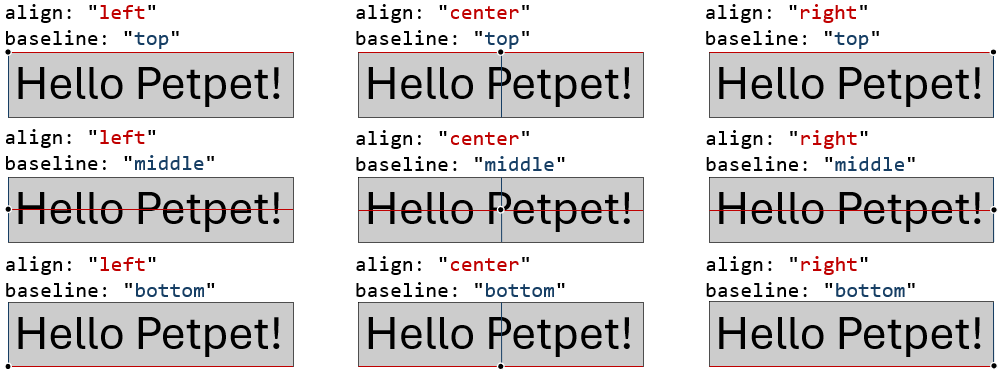
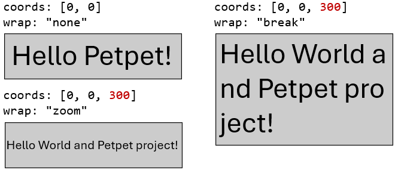

# Text Element

基础配置如下

```jsonc
{
    "type": "text",
    "text": "Hello Petpet!",    // 文本内容
    "coords": [100, 100],       // 坐标
    "color": "#fff"             // 颜色
}
```

| **属性**           | **类型**                         | **描述**                                           | **默认值**  |
|------------------|--------------------------------|--------------------------------------------------|----------|
| **text**         | string                         | 文本内容, 详见 [Text Content](#text-content)           | 必须       |
| **coords**       | [Coords](#coords)              | 文本坐标                                             | 必须       |
| **angle**        | float                          | 顺时针方向旋转角度，单位为度                                   | `0`      |
| **origin**       | [Offset](./length.md#offset)   | 文本旋转原点                                           | `center` |
| **color**        | [Color](./types.md#color)      | 文本颜色                                             | `#fff`   |
| **font**         | string                         | 字体名                                              | `simsun` |
| **size**         | float                          | 文本尺寸, 单位为 px, 别名为 `min_size`, 不能小于 `1`           | `16`     |
| **max_size**     | float                          | 文本最大尺寸, 仅在 [Text Wrap](#text-wrap) 为 `zoom` 时有效。 | `96`     |
| **align**        | [TextAlign](#text-align)       | 文本对齐方式                                           | `left`   |
| **baseline**     | [TextBaseline](#text-baseline) | 文本基线                                             | `top`    |
| **wrap**         | [TextWrap](#text-wrap)         | 文本换行方式                                           | `none`   |
| **style**        | [TextStyle](#text-style)       | 文本样式                                             | `plain`  |
| **stroke_color** | [Color](./types.md#color)      | 文本描边颜色                                           | `none`   |
| **stroke_size**  | float                          | 文本描边大小, 单位为 px                                   | `0px`    |
| **start**        | int                            | 起始索引                                             | `0`      |
| **end**          | int                            | 结束索引 (负数时为末尾索引, 例如 `-1` 表示最后一帧)                  | `-1`     |

## 动画

参数可使用数组实现动画, 例如:

```jsonc
{
  "type": "gif",
  "canvas": {
    "width": 300,
    "height": 300,
    "length": 3         // 动画帧数
  },
  "elements": [{
    "type": "text",
    "text": ["Hello!", "Hello, Pet!", "Hello, Petpet!"],
    "coords": [[0, 0], [50, 50], [100, 100]],
    "color": ["#fff", "#888", "#000"],
    "size": [16, 24, 32]
  }]
}
```

## Text Content

文本内容

- `"text"`

## Dynamic Text Content

使用占位符插入动态变量, 类似于 Shell 语法

- `"hello, ${to}!"`

占位符支持默认值

- `"hello, ${to:-world}!"`

## Coords

文本坐标

- `[x, y, max_width]`

```jsonc
[
    100,    // x (left)
    100,    // y (top)
    200     // max_width
]
```

> 坐标数组元素为 [Length](./length.md) 类型。

> `max_width` 仅在 [Text Wrap](#text-wrap) 为 `break` 或 `zoom` 时有效。

## Text Align

文本对齐方式

- `left`: 左对齐
- `center`: 居中对齐
- `right`: 右对齐

图例见 [TextBaseline](#text-baseline)

## Text Baseline

文本基线

- `top`: 上对齐
- `middle`: 中心对齐
- `bottom`: 下对齐



## Text Wrap

文本换行方式

- `none`: 不换行
- `break`: 自动换行: 当文本宽度超过 `max_width` 时换行。
- `zoom`: 缩放: 当文本宽度超过 `max_width` 时，将文本宽度缩小至 `max_width`。

> 当 `wrap` 为 `zoom` 时, `size` 属性为字体最小尺寸; 建议使用 `min_size` 与 `max_size` 定义尺寸。



## Text Style

文本样式

- `plain`: 默认样式
- `bold`: 加粗
- `italic`: 斜体
- `bold_italic`: 加粗斜体
